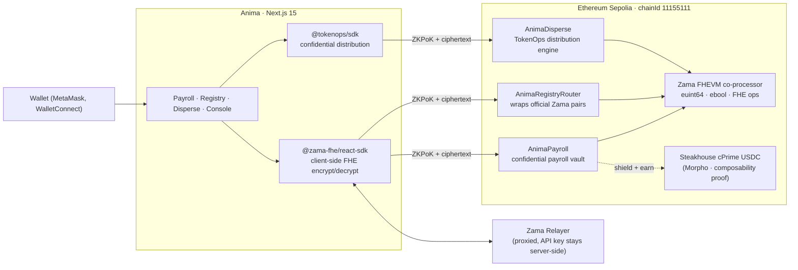

<h1 align="center">
  <picture>
    <source media="(prefers-color-scheme: dark)" srcset="apps/web/public/anima-wordmark-dark.png">
    
  </picture>
</h1>

<p align="center">
  <b>Programmable confidential finance — FHE payroll, compliant shielding, and confidential distribution on Ethereum Sepolia.</b>
</p>

<p align="center">
  <a href="LICENSE"></a>
  <a href="https://sepolia.etherscan.io"></a>
  <a href="https://www.zama.ai"></a>
  <a href="https://docs.zama.ai/protocol"></a>
  <a href="https://tokenops.xyz"></a>
</p>

Public blockchains expose everything. Every salary, every investor distribution, every treasury movement is visible to competitors, bots, and regulators simultaneously. This is why institutions won't put payroll or treasury on-chain — not because the technology is wrong, but because **complete transparency is a dealbreaker for business**.

Anima solves this with Fully Homomorphic Encryption. Balances, transfer amounts, and distribution allocations are encrypted on-chain. The blockchain sees the transaction. It never sees the value.


Submitted to the **Zama Developer Program Mainnet Season 3** across all three tracks simultaneously — Builder, Bounty (Confidential Wrapper Registry), and Special Bounty × TokenOps (Confidential Disperse).


---

## The problem Anima solves

Every FHE demo shows a counter or a token transfer. Anima shows a use case that institutions actually need:

| Pain | Without Anima | With Anima |
|---|---|---|
| **Payroll on-chain** | Every salary is public — competitors know your burn rate, employees know each other's pay | Salary amounts are `euint64` handles. Only the employee and the auditor can decrypt |
| **Token distributions** | Public airdrops expose $X to MEV front-runs. Average price drawdown: 17% in 72h | Recipient list and amounts are encrypted on-chain. MEV bots see addresses, never amounts |
| **DeFi with compliance** | Private holdings and public DeFi are two separate worlds | Shield to cUSDC → one-click earn yield on Morpho, amount stays encrypted the whole way |
| **Regulatory audit** | Privacy and compliance are mutually exclusive on public chains | Auditors get `FHE.allow` on selected balances — decryptable on demand, invisible by default |

---


<details>
<summary><b>For hackathon judges</b> · click to expand (track eligibility, on-chain verification, key code paths)</summary>

<br>

### Track eligibility

| Track | Contract | What makes it 1st-place |
|---|---|---|
| **Builder Track** | `AnimaPayroll.sol` | Programmable compliance: employee/CFO/auditor roles with selective `FHE.allow` disclosure. Composability: shield salary → earn yield on Morpho via Steakhouse Confidential Prime USDC vault. TVS dashboard on `/console`. |
| **Bounty Track** | `AnimaRegistryRouter.sol` | Reads the *official* Zama Wrappers Registry on Sepolia via RPC — no duplicate registry. Your router wraps official pairs. `officialPairCount()` returns the same number as Zama's registry. |
| **Special Bounty × TokenOps** | `AnimaDisperse.sol` + `@tokenops/sdk` | `TokenOpsClient.createConfidentialAirdrop()` handles encryption + on-chain proof. Signaling-risk calculator shows estimated MEV cost before confirming. Optional vesting curves (cliff + linear, all encrypted). |

### Verify on Sepolia (30 seconds, no install needed)

```bash
# Requires cast (Foundry). All three contracts live on Ethereum Sepolia.

# AnimaPayroll — confidential payroll vault (verified on Etherscan)
cast call 0x86ba59BdC7c6854610892B8a7B76294a94b8d1cB "confidentialProtocolId()(uint256)" \
  --rpc-url https://sepolia.infura.io/v3/34d389f9de9c42b4a696188beb46c03d

# AnimaRegistryRouter — surfaces official Zama registry
cast call 0xa4F161f54BC0f57b6331309D57b0315139De96a4 "officialPairCount()(uint256)" \
  --rpc-url https://sepolia.infura.io/v3/34d389f9de9c42b4a696188beb46c03d

# AnimaDisperse — confidential distribution engine
cast call 0x20a35EE0Ba03D3B4d3e94A2bb970f5a2B1083d58 "distributionCount()(uint256)" \
  --rpc-url https://sepolia.infura.io/v3/34d389f9de9c42b4a696188beb46c03d
```

### Key code paths

| Feature | Contract | Frontend |
|---|---|---|
| FHE payroll deposit + salary transfer | `contracts/src/AnimaPayroll.sol` | `apps/web/app/payroll/` |
| Employee / CFO / Auditor role views | `AnimaPayroll.grantObserver()` | `apps/web/app/payroll/views/` |
| Composable yield: shield → Morpho | `AnimaPayroll.earnYield()` | `apps/web/app/payroll/earn/` |
| TVS dashboard | — | `apps/web/app/console/tvs.tsx` |
| Official registry indexer | `AnimaRegistryRouter.sol` | `apps/web/app/registry/` |
| Wrap / unwrap official pairs | `AnimaRegistryRouter.wrap()` | `apps/web/app/registry/[pairId]/` |
| EIP-712 balance decrypt | `grantDecryptPermit()` | `apps/web/components/fhe/DecryptButton.tsx` |
| cTokenMock faucet | `AnimaRegistryRouter.faucet()` | `apps/web/app/registry/faucet/` |
| TokenOps confidential airdrop | `AnimaDisperse.sol` + `@tokenops/sdk` | `apps/web/app/disperse/` |
| Signaling-risk calculator | — | `apps/web/app/disperse/risk-calculator.tsx` |
| Recipient self-decrypt | `AnimaDisperse.requestDecryptPermit()` | `apps/web/app/disperse/[distId]/` |
| Encrypted vesting curves | `AnimaDisperse.createVestingSchedule()` | `apps/web/app/disperse/vesting/` |
| In-browser decryption (EIP-712) | — | `apps/web/lib/crypto/` |
| Relayer proxy (API key server-side) | — | `app/api/relayer/[chainId]/route.ts` |

</details>

---


## What Anima builds

Three surfaces. One lifecycle. One codebase.

```
Anima
│
├── Payroll / Vault          (Builder Track)
│   ├── Shield any ERC-20 salary into confidential ERC-7984 form
│   ├── Employee sees only their own balance
│   ├── CFO sees encrypted aggregate (FHE.add across employees)
│   ├── Auditor decrypts specific balances via FHE.allow + EIP-712 when legally required
│   ├── One-click yield: shield salary → earn on Morpho (Steakhouse Confidential Prime USDC)
│   │   amount never decrypted — composability proof against live Mainnet vault
│   └── TVS dashboard: Total Value Shielded across all surfaces
│
├── Wrapper Registry         (Bounty Track)
│   ├── Indexes the official Zama Wrappers Registry via RPC — no duplicate state
│   ├── One-click wrap / unwrap any official ERC-20 ↔ ERC-7984 pair
│   ├── EIP-712 user-decryption for any ERC-7984 balance
│   ├── "Add to Hardhat" button: copies import + address with one click
│   └── Built-in Sepolia faucet for official cTokenMocks
│
└── Disperse                 (Special Bounty × TokenOps)
    ├── TokenOps SDK: createConfidentialAirdrop handles encryption + on-chain proof
    ├── Signaling-risk calculator: shows estimated MEV front-run cost before deploy
    ├── CSV / JSON recipient import
    ├── Each recipient's allocation encrypted on-chain — list is never public
    ├── Recipient self-decrypt: one EIP-712 sig reveals only their own amount
    └── Vesting curves: cliff + linear, fully encrypted
```

---

## How it works




| Layer | Technology | Role |
|---|---|---|
| FHE co-processor | Zama FHEVM (`@fhevm/solidity`) | All encrypted arithmetic on-chain: `add`, `sub`, `lte`, `select`, `fromExternal` |
| Confidential token standard | ERC-7984 | `euint64` handles replace public `uint256` balances |
| Client encryption | `@zama-fhe/react-sdk` | Encrypts inputs, decrypts permitted values — no plaintext touches the server |
| Distribution engine | `@tokenops/sdk` | `createConfidentialAirdrop`, vesting curves, on-chain proofs |
| Network | Ethereum Sepolia (11155111) | All contracts deployed and Etherscan-verified |
| Composability | Morpho (Steakhouse Confidential Prime USDC) | Shielded salary earns yield without ever decrypting |

---

## Contracts

All contracts inherit `ZamaEthereumConfig`, use `@fhevm/solidity`, deployed on Sepolia (chainId 11155111).

| Contract | Address | Etherscan | Track |
|---|---|---|---|
| `AnimaPayroll` | `0x86ba59BdC7c6854610892B8a7B76294a94b8d1cB` | [view ↗](https://sepolia.etherscan.io/address/0x86ba59BdC7c6854610892B8a7B76294a94b8d1cB#code) | Builder |
| `AnimaRegistryRouter` | `0xa4F161f54BC0f57b6331309D57b0315139De96a4` | [view ↗](https://sepolia.etherscan.io/address/0xa4F161f54BC0f57b6331309D57b0315139De96a4) | Bounty |
| `AnimaDisperse` | `0x20a35EE0Ba03D3B4d3e94A2bb970f5a2B1083d58` | [view ↗](https://sepolia.etherscan.io/address/0x20a35EE0Ba03D3B4d3e94A2bb970f5a2B1083d58) | TokenOps |

Deployed on Ethereum Sepolia (chainId 11155111) · Deployer `0x10625674f9780E604074e94b6F6f6F026f3a1BdA` · Deployed 2026-07-08

### Gas benchmarks

FHE operations cost more than plaintext. Here is what to expect on Sepolia:

| Operation | Estimated gas | Notes |
|---|---|---|
| `deposit` (shield) | ~350,000 | `fromExternal` + `FHE.add` + 2× `allow` |
| `confidentialTransfer` | ~420,000 | `fromExternal` + `FHE.sub` + `FHE.add` + 4× `allow` |
| `withdraw` (FHE-gated) | ~550,000 | `fromExternal` + `FHE.lte` + `FHE.select` + `FHE.sub` + 2× `allow` |
| `wrap` (registry) | ~300,000 | Delegates to official wrapper + analytics event |
| `createDistribution` (N recipients) | ~200,000 + N × 180,000 | One `fromExternal` + `allow` per recipient |
| `claim` | ~280,000 | `FHE.sub` + 2× `allow` |

The Zama roadmap targets 100× gas reduction by 2026. These benchmarks reflect current Sepolia testnet costs.

---


### AnimaPayroll

Confidential payroll vault with programmable compliance. The core Builder Track contract.

```solidity
// Three roles, one contract
mapping(address => euint64) private _salaries;    // employee → encrypted balance
mapping(address => bool)    public observers;      // auditors / regulators

// Pay an employee: CFO calls this, amount stays encrypted
function paySalary(address employee, externalEuint64 encAmount, bytes calldata proof) external onlyCFO {
    euint64 amount = FHE.fromExternal(encAmount, proof);
    _salaries[employee] = FHE.add(_salaries[employee], amount);

    FHE.allowThis(_salaries[employee]);
    FHE.allow(_salaries[employee], employee);        // employee can decrypt their own

    // Programmable compliance: auditor gets selective disclosure automatically
    for (address auditor : _observers()) {
        FHE.allow(_salaries[employee], auditor);
    }
}

// FHE-gated withdrawal: verifies balance >= amount without decrypting either
function withdraw(externalEuint64 encAmount, bytes calldata proof) external {
    euint64 amount  = FHE.fromExternal(encAmount, proof);
    ebool   canPay  = FHE.lte(amount, _salaries[msg.sender]);
    _salaries[msg.sender] = FHE.select(canPay,
        FHE.sub(_salaries[msg.sender], amount),
        _salaries[msg.sender]
    );
    FHE.allowThis(_salaries[msg.sender]);
    FHE.allow(_salaries[msg.sender], msg.sender);
}

// Composable yield: shield salary → deposit into Morpho cPrime USDC vault
// Amount never decrypted — encrypted balance passed directly to vault interface
function earnYield(externalEuint64 encAmount, bytes calldata proof) external { ... }
```

**Three views in the UI:**
- **Employee** — sees only their own balance (decrypt via EIP-712)
- **CFO** — sees encrypted aggregate computed with `FHE.add` across all employees; decrypts total only
- **Auditor** — granted `FHE.allow` for specific employees; full EIP-712 decrypt on demand

### AnimaRegistryRouter

Thin router that surfaces the official Zama Wrappers Registry. Does not duplicate registry state.

```solidity
// Reads official registry via RPC — pairCount() matches Zama's registry exactly
function officialPairCount() external view returns (uint256) {
    return IZamaRegistry(OFFICIAL_REGISTRY).pairCount();
}

// Wraps official pair — calls the official ERC-7984 wrapper, emits analytics
function wrap(uint256 pairId, externalEuint64 encAmount, bytes calldata proof) external {
    address official = IZamaRegistry(OFFICIAL_REGISTRY).pairs(pairId).erc7984;
    IERC7984Wrapper(official).wrap(encAmount, proof);
    emit Wrapped(msg.sender, pairId, block.timestamp); // analytics only
}

// Faucet: mints official cTokenMocks — same tokens Zama docs reference
function faucet(address token, uint256 amount) external { ... }
```

**Why no custom registry contract:** the brief says "surfaces every ERC-20 ↔ ERC-7984 wrapper pair from the official Zama Wrappers Registry." Writing your own registry is the fragmentation Zama wants to stop. The router reads the canonical source; `cast call` on it returns the same count as Zama's registry.

### AnimaDisperse

Confidential distribution engine powered by the TokenOps SDK.

```typescript
// Frontend: apps/web/lib/tokenops/client.ts
import { TokenOpsClient } from '@tokenops/sdk'
import { ZamaSDK } from '@zama-fhe/sdk'

const client = new TokenOpsClient({ fhe: zamaSDK, chain: sepolia })

// One call handles encryption + ZKPoK generation + on-chain proof
const distribution = await client.createConfidentialAirdrop({
    token:      WRAPPER_ADDRESS,
    recipients: [{ address: '0xAlice', amount: 1000n }, ...],
    vestingSchedule: { cliff: 30, linear: 180 },  // optional, all encrypted
})
```

The contract stores `mapping(address => euint64) allocations` — recipient amounts encrypted with FHE. The full recipient list is never revealed on-chain. Any address can call `requestDecryptPermit(distId)` to get `FHE.allow` on their own allocation, then decrypt via EIP-712.

---


## Repo structure

```
anima/
├── apps/
│   └── web/                          Next.js 15 frontend
│       ├── app/
│       │   ├── payroll/              Builder Track: payroll vault UI
│       │   │   ├── page.tsx          Employee / CFO / Auditor view switcher
│       │   │   ├── earn/             Shield → Morpho yield flow
│       │   │   └── views/            Role-specific decryption views
│       │   ├── registry/             Bounty Track: official registry + wrap/unwrap
│       │   │   ├── page.tsx          Pair table (sourced from official registry)
│       │   │   ├── [pairId]/         Wrap / unwrap / decrypt per pair
│       │   │   └── faucet/           cTokenMock mint
│       │   ├── disperse/             TokenOps: confidential distribution
│       │   │   ├── page.tsx          Create distribution + signaling-risk calculator
│       │   │   ├── [distId]/         Recipient: reveal + claim
│       │   │   └── vesting/          Vesting schedule builder
│       │   ├── console/              Operator dashboard + TVS dashboard
│       │   └── api/
│       │       ├── relayer/[chainId] Zama relayer proxy (API key server-side)
│       │       └── auth/             SIWE nonce / verify / me / logout
│       ├── components/
│       │   ├── fhe/                  ConfidentialAmount, FheInput, DecryptButton, ShieldBadge
│       │   ├── payroll/              SalaryRow, RoleView, YieldCard, TVSCounter
│       │   ├── registry/             PairTable, WrapForm, FaucetButton, HardhatCopyButton
│       │   └── disperse/             RecipientImport, RiskCalculator, AllocationRow, ClaimCard
│       └── lib/
│           ├── zama/                 ZamaSDK config, wagmi + ZamaProvider setup
│           ├── tokenops/             TokenOpsClient init, createConfidentialAirdrop wrapper
│           ├── crypto/               Browser-side AES-GCM, HKDF, EIP-712 decrypt (kept from v1)
│           ├── chain/                Sepolia chain def, contract ABIs, viem clients
│           └── siwe/                 iron-session SIWE auth (kept from v1)
├── contracts/
│   ├── src/
│   │   ├── AnimaPayroll.sol          Builder: payroll vault + observer roles + yield composability
│   │   ├── AnimaRegistryRouter.sol   Bounty: thin router over official Zama registry
│   │   └── AnimaDisperse.sol         TokenOps: confidential distribution engine
│   ├── test/                         Hardhat + @fhevm/hardhat-plugin test suite
│   └── scripts/
│       └── deploy.ts                 Deploys all three to Sepolia, writes addresses.ts
└── packages/
    └── shared/
        ├── src/addresses.ts          Auto-written by deploy script
        └── src/abis.ts               Auto-generated by typechain
```

The previous `packages/core`, `packages/cli`, `packages/gateway`, `packages/relay`, and `packages/plugin-*` (0G infrastructure) are removed. The web app is self-contained in `apps/web`. Contract bindings live in `packages/shared`.

---

## Quickstart

### Prerequisites

- Node.js 22+
- pnpm 9+
- Sepolia ETH — [faucet.sepolia.dev](https://faucet.sepolia.dev) or [sepoliafaucet.com](https://sepoliafaucet.com)
- Zama API key — [docs.zama.ai](https://docs.zama.ai) → get API key
- Infura or Alchemy Sepolia RPC

### Install

```bash
git clone https://github.com/s0nderlabs/anima
cd anima
pnpm install
```

### Configure

```bash
cp apps/web/.env.local.example apps/web/.env.local
```

```env
# Sepolia RPC
NEXT_PUBLIC_RPC_URL=https://sepolia.infura.io/v3/YOUR_KEY

# WalletConnect project ID (get one free at cloud.walletconnect.com)
NEXT_PUBLIC_WC_PROJECT_ID=your_wc_project_id

# Zama relayer — proxied through /api/relayer so this key never reaches the browser
ZAMA_API_KEY=your_zama_api_key

# iron-session secret for SIWE sessions (min 32 chars)
SESSION_SECRET=at_least_32_chars_of_random_secret_here

# TokenOps API key (get one at tokenops.xyz)
TOKENOPS_API_KEY=your_tokenops_api_key
```

### Deploy contracts

```bash
# Compile all FHE contracts
pnpm compile

# Run full test suite against local FHEVM mock (no Sepolia needed for tests)
pnpm test:contracts

# Deploy all three to Sepolia + write addresses to packages/shared/src/addresses.ts
pnpm deploy:sepolia
```

### Run

```bash
pnpm dev
# → http://localhost:3210
```

---


## Using Anima

### Payroll (Builder Track)

**As a CFO / treasury:**
1. Connect wallet, sign in with SIWE at `/console`
2. Go to `/payroll` → CFO view
3. Add employees, grant an auditor address via `grantObserver(auditor)`
4. **Pay salary** — enter employee + encrypted amount. The SDK encrypts client-side, sends ZKPoK + ciphertext. Auditor gets `FHE.allow` automatically on every payment.
5. **Earn yield** — click "Earn Yield" on any balance. Shields salary directly into the Steakhouse Confidential Prime USDC vault on Morpho. Amount stays encrypted through the entire deposit.
6. **TVS** — `/console` shows Total Value Shielded across vault, registry, and disperse in real time.

**As an employee:**
1. Go to `/payroll` → Employee view
2. Click **Reveal balance** — one EIP-712 signature, balance decrypts in-browser only. Server sees nothing.
3. Click **Withdraw** — enter amount. Contract verifies `balance ≥ amount` via FHE comparison; neither value decrypted on-chain.

**As an auditor:**
1. Go to `/payroll` → Auditor view
2. Your address was pre-granted `FHE.allow` on all salaries you cover
3. Select employee, click **Decrypt** — EIP-712 sign, balance revealed only in your browser

### Registry (Bounty Track)

1. Go to `/registry`
2. **Pair table** — all official ERC-20 ↔ ERC-7984 pairs, live-indexed from the Zama Wrappers Registry. Same count as `cast call <ZAMA_REGISTRY> "pairCount()"`.
3. **Faucet** — click "Get testnet tokens" on any pair row. Mints the official cTokenMock.
4. **Wrap** — select pair, enter amount, click Wrap. Calls the official ERC-7984 wrapper directly.
5. **Unwrap** — two-step flow with progress callbacks: "Submitting unwrap…" → "Waiting for decryption proof…" → "Complete."
6. **Decrypt balance** — click the lock icon on any ERC-7984 row. EIP-712 sign → balance decrypted in-browser.
7. **Add to Hardhat** — one button copies `import { IConfidentialToken } from "@openzeppelin/confidential"` and the exact pair address to clipboard. Eliminates the fragmentation Zama is fighting.

### Disperse (Special Bounty × TokenOps)

**As a distributor:**
1. Go to `/disperse` → Create
2. Pick an ERC-7984 token
3. Import recipients: drag-and-drop CSV, paste JSON, or add manually
4. **Signaling-risk calculator** runs automatically: "A public distribution of this size would expose $X to MEV bots. Estimated front-run cost: ~17% within 72h." Source: TokenOps acquisition data.
5. Optionally configure vesting: cliff (days) + linear vesting period — all encrypted
6. **Deploy** — `TokenOpsClient.createConfidentialAirdrop()` encrypts all amounts, generates ZKPoKs, submits `AnimaDisperse.createDistribution`. On success: "Distribution sealed. 0 addresses or amounts publicly visible."
7. Share claim links per recipient, or post the root URL `/disperse/[distId]`

**As a recipient:**
1. Open your claim link `/disperse/[distId]`
2. Connect wallet — if you have an allocation, "You have a pending allocation" appears
3. **Reveal my allocation** — one EIP-712 signature. Only your amount decrypts, in your browser only.
4. **Claim** — one transaction. Tokens arrive in your wallet.

---


## The FHE pattern Anima uses everywhere

The same four-step pattern is applied consistently across all three contracts. Judges should see this in every state-changing function:

```solidity
// Step 1: accept the user's encrypted input + its ZKPoK
function paySalary(address employee, externalEuint64 encAmount, bytes calldata proof) external {

    // Step 2: verify proof, bind to this contract + msg.sender, convert to euint64
    euint64 amount = FHE.fromExternal(encAmount, proof);

    // Step 3: operate homomorphically — no plaintext is ever decrypted on-chain
    _salaries[employee] = FHE.add(_salaries[employee], amount);

    // Step 4: grant permissions — BOTH are required
    FHE.allowThis(_salaries[employee]);      // contract can use this value in future ops
    FHE.allow(_salaries[employee], employee); // employee can decrypt off-chain via EIP-712

    // Programmable compliance: auditors get selective disclosure automatically
    for (uint i = 0; i < _observerCount; i++) {
        FHE.allow(_salaries[employee], _observers[i]);
    }
}
```

Missing `FHE.allowThis` → contract can never update the value again (silent regression).
Missing `FHE.allow(value, caller)` → caller cannot decrypt their own balance (silent permission denial).
Anima calls both unconditionally on every mutation in every contract.

### FHE types reference

| Solidity type | Meaning | Where used |
|---|---|---|
| `euint64` | Encrypted uint64, stored on-chain | All balances and amounts |
| `ebool` | Encrypted boolean | FHE-gated conditions (`balance ≥ amount`) |
| `externalEuint64` | User-supplied encrypted input (browser) | All function parameters |
| `FHE.fromExternal(enc, proof)` | Verify ZKPoK + convert to `euint64` | Entry point for every user input |
| `FHE.add(a, b)` | Homomorphic addition | Deposit, salary top-up, accumulate allocations |
| `FHE.sub(a, b)` | Homomorphic subtraction | Withdraw, claim |
| `FHE.lte(a, b)` | Homomorphic ≤ comparison | FHE-gated withdrawal guard |
| `FHE.select(cond, a, b)` | Conditional cmux | Apply withdrawal only when guard passes |
| `FHE.allowThis(v)` | Contract permission | Every mutation |
| `FHE.allow(v, addr)` | User permission | Employee, auditor, CFO, recipient |

---

## Security model

**Client-side encryption only.** Plaintext amounts never leave the browser. `@zama-fhe/react-sdk` encrypts inputs using FHE artifacts cached in IndexedDB and sends only ciphertext + ZKPoK to the chain.

**ZKPoK binding.** `FHE.fromExternal(encValue, proof)` verifies the ciphertext was encrypted by `msg.sender` (prevents reuse from another account) and bound to `address(this)` (prevents cross-contract replay).

**Relayer proxy.** `app/api/relayer/[chainId]/route.ts` forwards FHE relayer requests server-side. The Zama API key is in `ZAMA_API_KEY` on the server; it never reaches the browser.

**Programmable compliance, not backdoors.** Auditor access is granted explicitly via `grantObserver(address)` by the CFO. It uses the same `FHE.allow` mechanism as employee self-decryption — there is no privileged key, no admin function, no secret path. An auditor cannot decrypt anything they were not explicitly granted.

**SIWE sessions.** `iron-session` + EIP-4361. `httpOnly`, `sameSite: lax`, `secure` in production, 7-day expiry.

**No admin keys, no upgrades.** All Anima contracts are non-upgradeable. No owner function, no proxy, no emergency pause.

---

## Zama integration map

| Zama component | File | What it does |
|---|---|---|
| `@fhevm/solidity` | All three contracts | `euint64`, `ebool`, `FHE.*` ops, `ZamaEthereumConfig` |
| `ZamaEthereumConfig` | Inherited by all | Wires Sepolia FHEVM gateway at deploy time — required or no FHE op runs |
| `@fhevm/hardhat-plugin` | `hardhat.config.ts` + tests | Mock FHEVM for local tests, `fhevm` global, `FhevmType` |
| `@zama-fhe/sdk` | `apps/web/lib/zama/` | `ZamaSDK`, `createConfig`, `createWrappedToken`, `shield`, `confidentialTransfer`, `unshield` |
| `@zama-fhe/react-sdk` | `apps/web/` | `ZamaProvider`, `useConfidentialBalance`, `useShield`, `useConfidentialTransfer`, `useUnshield` |
| ERC-7984 | `AnimaRegistryRouter` | Official confidential ERC-20 standard; every token in the registry implements it |
| EIP-712 user-decryption | `DecryptButton.tsx` + every contract | `FHE.allow(value, user)` → wallet EIP-712 sign → Zama decrypts → plaintext in-browser |
| Zama Wrappers Registry | `AnimaRegistryRouter` | Read via RPC — Anima surfaces it, does not duplicate it |
| `@tokenops/sdk` | `apps/web/lib/tokenops/` + `AnimaDisperse` | `createConfidentialAirdrop`, vesting curves, encrypted on-chain proofs |

---

## TVS — Total Value Shielded

Anima tracks TVS across all three surfaces and displays it on `/console`. This is the metric Zama uses to measure protocol adoption. Anima is the first Season 3 submission to report it as a first-class number.

```
TVS = Σ encrypted vault balances
    + Σ wrapped ERC-7984 balances via registry router
    + Σ unclaimed encrypted distribution allocations
```

TVS is computed from on-chain encrypted supply via `IERC7984.totalEncryptedSupply()` — no decryption needed. The console shows the USD equivalent using public ERC-20 price feeds for the underlying asset.

---

## Development

### Smart contracts (Hardhat)

Foundry is not used. The Zama FHEVM mock co-processor ships as a Hardhat plugin — `@fhevm/hardhat-plugin`. All FHE operations require it.

```bash
pnpm compile              # compile all contracts
pnpm test:contracts       # full test suite against local FHEVM mock
npx hardhat test test/AnimaPayroll.ts    # specific file
pnpm deploy:sepolia       # deploy + write addresses.ts
```

### Frontend (Next.js 15)

```bash
pnpm dev                  # Turbopack dev server → localhost:3210
pnpm typecheck            # TypeScript strict check
pnpm lint                 # Biome
pnpm build                # production build
```

### Workspace

```bash
pnpm install              # install all workspace deps
pnpm lint                 # lint everything
pnpm typecheck            # typecheck everything
```

---

## Packages

| Dir | Purpose |
|---|---|
| `apps/web` | Next.js 15 — payroll, registry, disperse, console, docs |
| `packages/shared` | Auto-generated contract addresses + TypeScript ABIs (typechain) |

---

## Operator console

`/console` is Anima's multi-surface operator dashboard. Connect any EIP-1193 wallet, sign in with SIWE, and manage everything in one place:

- **TVS dashboard** — Total Value Shielded across all three surfaces
- **Payroll view** — employee / CFO / auditor role switch with appropriate decrypt access
- **Registry** — wrap/unwrap and faucet shortcuts
- **Disperse** — manage distributions, view pending claims
- All decryption runs in-browser via EIP-712. No key material touches the server.

---

## Status

Building for **Zama Developer Program Season 3** (Builder, Bounty, Special Bounty × TokenOps).

- [ ] `AnimaPayroll.sol` — contract + tests
- [ ] `AnimaRegistryRouter.sol` — contract + tests
- [ ] `AnimaDisperse.sol` + `@tokenops/sdk` integration — contract + tests
- [ ] Sepolia deployment + Etherscan verification
- [ ] Frontend: payroll views (employee / CFO / auditor)
- [ ] Frontend: TVS dashboard
- [ ] Frontend: registry pair table + wrap/unwrap
- [ ] Frontend: disperse + signaling-risk calculator
- [ ] Frontend: vesting schedule builder
- [ ] 3-minute video demo

---

## License

MIT
freebuff --continue 2026-07-08T00-21-00.037Z